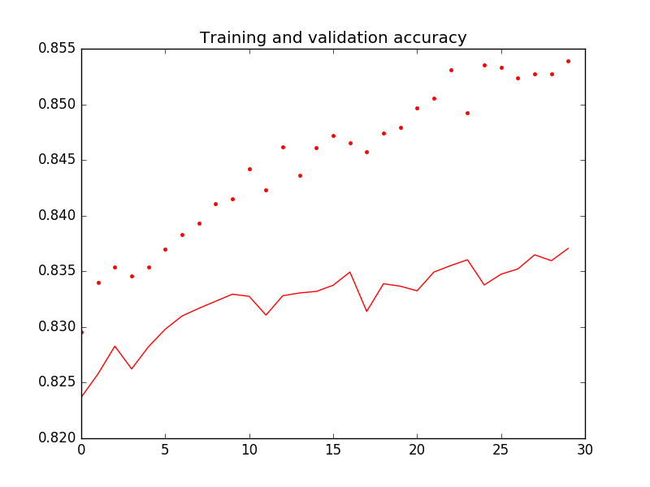
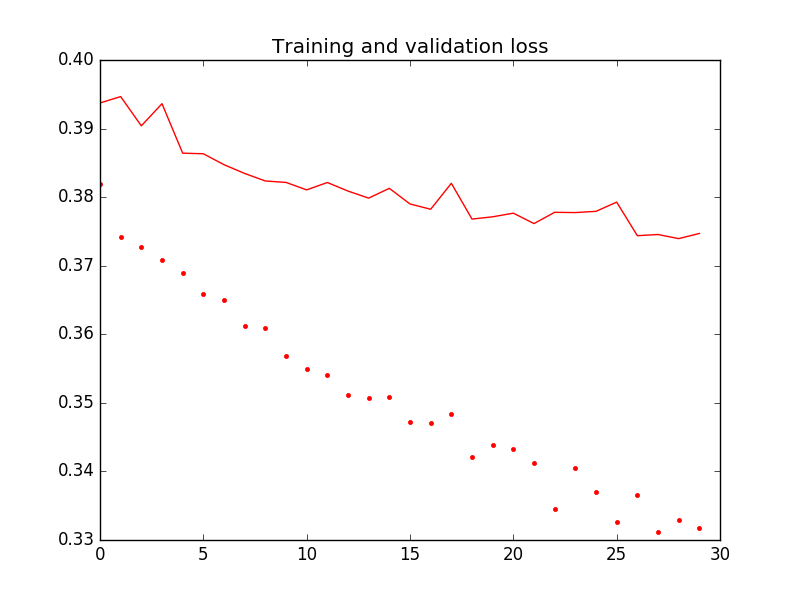
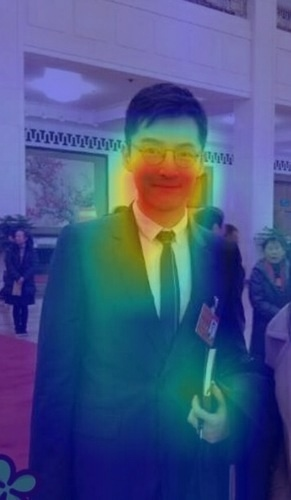
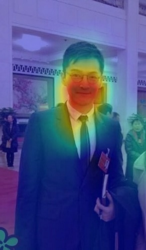
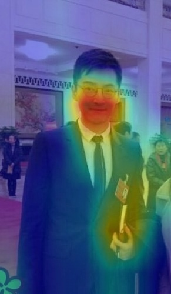

# Multi-label-Classification
<<<<<<< HEAD
labels contain class and it's attribute

训练的分类准确率达到0.8

准确率和loss如图所示：

使用数据集图片中包含的标签有9种，分别是: is male, has long hair, has glasses, has hat, has t-shirt, has long sleeves, has shorts, has jeans, has long pants.

改写了CAM算法的代码，生成了heatmap图，在图中标注了预测的attributes的大体位置。效果如图:

is_male.jpg

have_glasses.jpg

have_hat.jpg (分类错误)

参考资料：

[1] Bourdev L, Maji S, Malik J. Describing people: A poselet-based approach to attribute classification[C]// IEEE International Conference on Computer Vision. IEEE, 2011:1543-1550.

[2] Zhou B, Khosla A, Lapedriza A, et al. Learning Deep Features for Discriminative Localization[C]// Computer Vision and Pattern Recognition. IEEE, 2016:2921-2929.

[3] https://github.com/keras-team/keras/issues/741

[4] https://github.com/suraj-deshmukh/Multi-Label-Image-Classification/blob/master/miml.ipynb
=======
Multi-label attributes Classification and CAM
>>>>>>> d647dc881c3db46d68511e38e5ba0616694d31f4
