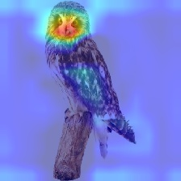
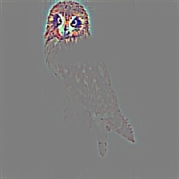

# Multi-label-Classification
Multi-label attributes Classification and CAM& grad-cam

（6.26 晚补充部分）之前一直放着grad-cam没有看懂，现在首先对这一部分做补充。

CAM算法简单而且很好用，但是它修改了原本的网络，对于这个问题，Grad-cam在不修改原网络的情况下也可以实现一样的效果，两者等价的理论推导在论文中有证明。

原理简单理解在这里做个记录：

用输出类别的权重对特征图求梯度，取均值 (14, 14, 512)->( 512,) 后分别乘以特征图的每一层相加得到cam

**导向反向传播**，用到了注册梯度函数，定义一个新的op类型，只反向传播梯度为正的值。对(14,14,512)求最大值(14,14)后的和对输入求梯度。（6.26 晚补充部分）

训练的分类准确率达到0.8

准确率和loss如图所示：

使用数据集图片中包含的标签有9种，分别是: is male, has long hair, has glasses, has hat, has t-shirt, has long sleeves, has shorts, has jeans, has long pants.

改写了CAM算法的代码，生成了heatmap图，在图中标注了预测的attributes的大体位置。效果如图:

is_male.jpg

have_glasses.jpg

have_hat.jpg (分类错误)

参考资料：

[1] Bourdev L, Maji S, Malik J. Describing people: A poselet-based approach to attribute classification[C]// IEEE International Conference on Computer Vision. IEEE, 2011:1543-1550.

[2] Zhou B, Khosla A, Lapedriza A, et al. Learning Deep Features for Discriminative Localization[C]// Computer Vision and Pattern Recognition. IEEE, 2016:2921-2929.

[3] https://github.com/keras-team/keras/issues/741

[4] https://github.com/suraj-deshmukh/Multi-Label-Image-Classification/blob/master/miml.ipynb

